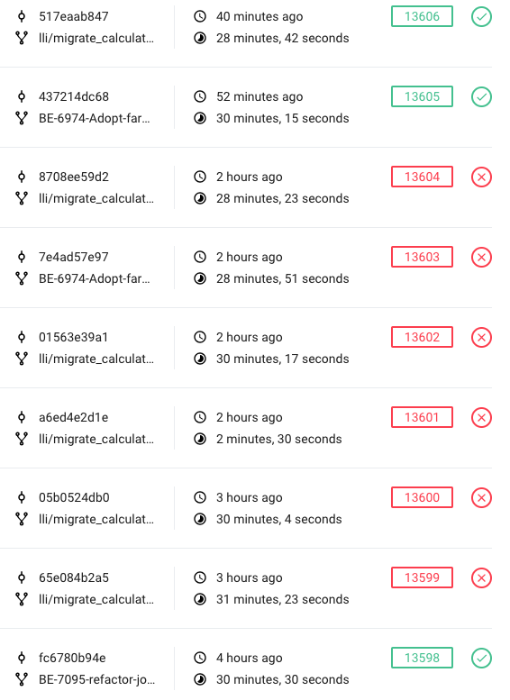

# Best Practice on Tests, Factories and Fixtures
## Starter
Our specs are slow, extremely.

In our CI runner, they usually take around 28 to 30 minutes to finish all 13000(approx.) examples. But why are they slow?

## Why Factories Are Slow
I'll cut the crap, it is caused by factories.

We rely heavily on Factory_Girl, or Factory_Bot (https://github.com/thoughtbot/factory_bot) these days, to generate sample ActiveRecord objects and persist them in PG during tests. It is designed as a replacement of Rails fixtures, which makes our life much easier to manage test records. Comparing to fixtures, which are defined as plain text in YAML files, factories are defined by ruby code, and you can easily create complex objects with associations, validations and etc, while fixtures, on the other hand, are pretty hard to maintain.

But the accessibility of factories comes with a price -- factories are much slower than fixtures.

If you still do not have a clear understanding of how much factories are slowing us, here is a report I profiled from our specs with TestProf.
```
user
  build_stubbed called 446 times took 1.27 seconds total
  create called 6833 times took 115.27 seconds total
  FactoryGirl::Strategy::Create called 1082 times took 14.53 seconds total
  attributes_for called 28 times took 0.27 seconds total
  build called 586 times took 1.45 seconds total
  FactoryGirl::Strategy::Build called 72 times took 0.18 seconds total

country
  build_stubbed called 2277 times took 4.92 seconds total
  FactoryGirl::Strategy::Create called 21005 times took 135.08 seconds total
  create called 13436 times took 93.62 seconds total
  FactoryGirl::Strategy::Build called 707 times took 1.11 seconds total
  build called 176 times took 0.33 seconds total

brand
  build_stubbed called 650 times took 3.09 seconds total
  FactoryGirl::Strategy::Create called 7516 times took 278.77 seconds total
  create called 989 times took 39.23 seconds total
  build called 111 times took 0.53 seconds total
  FactoryGirl::Strategy::Build called 137 times took 0.56 seconds total

delivery_timeslot
  build_stubbed called 213 times took 3.12 seconds total
  create called 945 times took 12.55 seconds total
  FactoryGirl::Strategy::Create called 2680 times took 271.57 seconds total
  FactoryGirl::Strategy::Build called 131 times took 13.9 seconds total
  build called 17 times took 0.81 seconds total

order_fulfillment
  build_stubbed called 109 times took 4.02 seconds total
  create called 2116 times took 310.7 seconds total
  FactoryGirl::Strategy::Create called 255 times took 61.1 seconds total
  build called 45 times took 6.89 seconds total
  FactoryGirl::Strategy::Build called 23 times took 3.47 seconds total

product
  FactoryGirl::Strategy::Create called 460 times took 47.97 seconds total
  create called 1872 times took 144.55 seconds total
  build_stubbed called 269 times took 2.47 seconds total
  build called 26 times took 1.87 seconds total
  FactoryGirl::Strategy::Build called 15 times took 0.17 seconds total
```

The above are among the slowest factories but not all of them, to see the full report. Eventually, all creations of factories have cost me 4133.13 seconds (the specs were run on my machine, so it's much slower than CI), which took 90% of the total execution time.

### Why factories are slower than fixtures

Essentially factories create ActiveRecord objects just like you create them anywhere else. They instantiate the objects, run the callbacks(validations and etc.), create associations, and at last, save the objects into PG. However, these operations take time.

Rails handles fixtures in a different way. It loads fixtures as plain text and writes these data directly into PG, with only SQL executions, and thus, no callback, no validation and it does not care about associations. Therefore it is much faster.

BTW, if you are not familiar with fixtures, this is what it usually looks like:

```
DEFAULTS: &DEFAULTS
  slug: Foo
  active: true
  created_at: <%= Time.now %>
default:
  default_delivery_start_time: <%= Time.now %>
  default_delivery_end_time: <%= Time.now %>
  minimum_order_free_delivery_cents: 10
  default_delivery_fee_cents: 10
  timezone: PST
  display_order: 0
  country: default
  currency: SGD
  <<: *DEFAULTS
```

Here I quote a paragraph from the creator of Factory_girl:

> I've talked about speeding up unit tests when using Factory_Girl by relying on FactoryGirl.build_stubbed, but there’s another surefire way to speed up your test suite with Factory Girl. Don't use it.

### Overuse of DatabaseCleaner

https://github.com/DatabaseCleaner/database_cleaner

Comparing to factories, overusing DatabaseCleaner is a lesser issue, but still, it is a very inefficient operation, especially `DatabaseCleaner.clean`, which basically wipes out all data in the test database.

At this moment, we have 208 cases of calling this method (maybe more). I haven't profiled this specific operation yet.

I noticed that there are several strategies in DatabaseCleaner, including:

- transaction: which rolled back all the changes in one test.

- truncation/deletion: which wipes out all data; we are currently using this method.

Considering that we instantiate an empty DB at the beginning of the suite without loading any fixture, these two strategies act pretty much the same.

Wiping database for hundred times during the test, that is just too bad.

## Potential Solution

Before I wrote this article, I had spent a few days toward finding the easiest way to solve this issue. Here are a few ways I investigated:

### In-Memory Storage Engine
A drop-in solution to speed up data persistence is writing into RAM instead of disk. As one of the storage adapter used by Rails, sqlite allows it, but unfortunately, we are using jsonb data type a lot which is not supported by sqlite, therefore NO.

What about PG? Does it support in-memory engine?

The answer at this moment is no. Unlike MySQL and some other DBs, such as MongoDB, PG is not designed and implemented with a pattern called pluggable storage engine. In MySQL, with pluggable storage engine, you can switch engines easily (e.g. MyISAM and InnoDB). Someone asked about mounting PG file path into memory, the answer is also no, that is because PG's core data reference, TID, utilizes a physical address in the disk as the value.

### Use build_stubbed
build_stubbed is an alternative method of using factories to create objects. It instantiates and assigns attributes just like build (which essentially uses the `create` method), but underneath, it uses stubbing to make the object look like been persisted with associations and a handful of methods that interact with the database. You may actually consider it as a much better alternative way of using `double`.

The problem is, it is still stubbing. In most of our test cases (tens of thousands), they will try to either save into or reload the data from DB and check its consistency, which makes us almost impossible to refactor all these methods, there are just way too many.

### Use Fixtures
Unlike stubbing, fixtures are real data in DB. so there will be much less effort needed. Instead, we simply need to load corresponding fixtures at the beginning of the specs.

## Best Pratice
### Avoid Persisting into Database
Most unit tests don't need persisted data. If the test case is even simpler, just use doubles.
### Use Fewer Associations
Associations are slow. Here I'll use someone else's example:
We first create the factory, including the associated profile.
```
FactoryGirl.define do
  factory :user do
    profile
  end

  factory :profile
end
```
Lets re-run the spec using Factory Girl:

rspec spec/models/user_spec.rb
..

Finished in 0.02278 seconds
2 examples, 0 failures


Lets run it again, but this time using User.new:

rspec spec/models/user_spec.rb
..

Finished in 0.00474 seconds
2 examples, 0 failures

With only one simple association, the time cost increased by 5 times. Don't even need to mention that we have factories which include multiple complex associations, such as orders.

### Make Specs Transactional and Get Rid of DatabaseCleaner
We use tons of before(:all) and instance variables, I get it, it creates fewer objects and shares them between specs, sometimes even I wrote in such way, it's codewise efficient, how nice.

But it is a shitty habit.

Specs are meant to be isolated and transactional (especially BDD), whenever a spec is finished, anything related should be reset. With using shared variables, the specs end up in a broken pattern and become vulnerable. If you check the PRs, you should see several ones which tried to fix flaky specs. However, I don't mean that we should get rid of instance variables at all, in some cases, they are still useful, but we should definitely try not to abuse the usage.

This is also the inevitable consequence of persisting data into DB. When a spec is finished, it can remove the in-memory data but not those in the database, thus you have to remove the records manually. It is not handy, so we introduced DatabaseCleaner, which makes things even worse. As I mentioned above, using DatabaseCleaner is not only inefficient but also makes our tests not thread-safe.

The suggestion is, try not to use before(:all) and shared variables, whenever you think creating objects is not efficient in each spec, try to use build_stubbed and doubles. There is always another way.


## Some less important but good practice
### Use simpler object
Create the object with attributes you need. You don't always need an associated address object to a user, in some cases probably only id and name.

### Lazy load is usually better
I can't argue upon this statement because let and let! are just equivalent regarding efficiency. but unless let! is definitely needed, lazy load is still nicer.

### Profile your spec
If you wrote a spec which cost seconds to execute, and you do not understand why, try to profile it and see which methods are least efficient.

